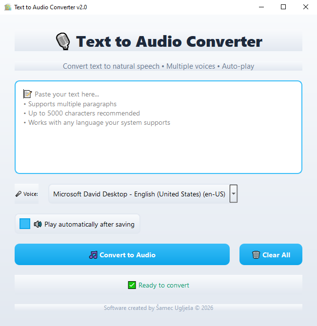

# Text-to-Audio Converter 🎙️  
### Version 2.0 – Local • Lightweight • Enterprise Utility

<p align="center">


</p>

---

## 🛡 About the Project

**Text-to-Audio Converter** is a desktop application that quickly converts text into natural speech.  

- 100% local application, no data sent over the internet  
- Modern GUI design built with **PyQt5**  
- Supports multiple voices and automatic playback  
- Easy saving and playback of audio files  

---

## 🎯 Intended For

- 👤 Individual users who want to convert text to speech  
- 💻 Students, writers, journalists, and developers  
- 📝 Situations where quick audio generation from text is needed  

---

## 🚀 Features

| Feature | Description |
|---------|-------------|
| **Text → Audio** | Converts text into an audio (.wav) file |
| **Multiple Voices** | Choose from system voices or installed TTS voices |
| **Auto-play** | Optionally play audio immediately after saving |
| **Fast Conversion** | Quick text-to-speech process without internet |
| **Text Management** | Copy and clear text easily in the main field |
| **Conversion Progress** | Shows progress while generating the audio file |
| **Cross-platform** | Works on Windows, macOS, and Linux |
| **Responsive Design** | GUI automatically adjusts to screen size |
| **Character Count Limit** | Warns when text exceeds 10,000 characters |

---

## ⌨️ Shortcuts & Controls

| Button / Control | Action |
|-----------------|--------|
| **Convert to Audio** | Generates audio from entered text |
| **Clear All** | Clears text input and resets status |
| **Voice Dropdown** | Select TTS voice for speech output |
| **Play Automatically Checkbox** | Toggle auto-play after saving audio |
| **Text Area** | Input your text here, supports multiple paragraphs |

---

## ⚙️ Technologies & Dependencies

- Python 3.10+  
- [PyQt5](https://pypi.org/project/PyQt5/) – GUI
- [pyttsx3](https://pypi.org/project/pyttsx3/) – Text-to-Speech engine

---

## 📷 Screenshot



---

## 🛠 Project Structure

```
text-to-audio/
│
├─ app.py # Main application        # Main application
├─ desktop.py # Main application    # First version
├─ app _withouth_text_limitation.py # Main application
├─ ico.ico # Window icon (optional)
├─ requirements.txt # Dependencies
└─ README.md # This file
```

---

## 🔄 Application Life-Cycle

1. Launch the application → empty text field  
2. Enter text → select voice and auto-play option  
3. Click "Convert to Audio" → generates the audio file  
4. Audio is saved and optionally played automatically  
5. Copy or clear text as needed  
6. Close the application using the X button  

---

## ⚠️ Max Character Limit

- Recommended max: **5,000 characters** for optimal performance  
- Hard limit enforced: **10,000 characters**  
- Exceeding the limit will trigger a warning and block conversion  

---

## 🧩 Common Issues & Solutions

| Issue | Solution |
|-------|---------|
| Voice not found | Ensure the selected voice is installed on your system; default voice will be used if not |
| Audio does not play | Auto-play is visually indicated by a checkbox, functionality works regardless |
| Application does not start | Make sure [PyQt5](https://pypi.org/project/PyQt5/) and [pyttsx3](https://pypi.org/project/pyttsx3/) are installed |

---

## ⚙️ Advanced Options (Future / Hidden)

- **Adjustable Speech Rate** – future slider to modify speaking speed  
- **Volume Control** – change output volume per audio file  
- **MP3 Export** – currently WAV only, MP3 support planned via `pydub`  

---

## 🏆 Unique Values

- Lightweight and fast – completely local application  
- Supports multiple voices and automatic playback  
- Minimal dependencies, ready for distribution  
- Responsive and modern GUI design  
- Easy-to-use interface for professional or casual users  

---

## 📜 License

This project is released under the **GPLv3** license.  
If you use or modify the code, you are required to keep attribution and release your changes under the same license.

---

🎙️ **Text-to-Audio Converter** – Fast, local, and responsive solution for converting text into speech.  
- [pyttsx3](https://pypi.org/project/pyttsx3/) – local Text-to-Speech engine  
- [PyQt5](https://pypi.org/project/PyQt5/) – GUI library
